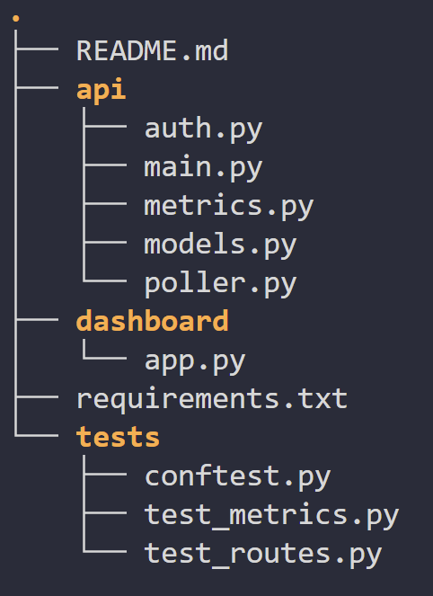

# 📊 DevOps Monitoring Dashboard — MVP

Mini‑projet DevOps consistant à développer un **dashboard de monitoring** avec :

- un **backend FastAPI** exposant des métriques système et la gestion de serveurs monitorés
- un **frontend Streamlit** affichant les métriques en temps réel
- une **suite de tests automatisés** avec pytest

---

## 🧱 Architecture du projet



---

## ⚙️ Prérequis

- Python **≥ 3.10** (testé avec Python 3.13)
- `pip`
- Environnement virtuel recommandé

---

## 🚀 Installation

```bash
python -m venv .venv
source .venv/bin/activate   # Windows : .venv\Scripts\activate

pip install -r requirements.txt
```

---

## 🔐 Configuration

Une clé API est requise pour les opérations d’écriture (POST, DELETE).

```bash
export API_KEY=dev-secret-key
```

Une valeur par défaut est définie pour le développement local.

---

## ▶️ Lancer l’application

### Backend FastAPI

```bash
uvicorn api.main:app --reload --port 8000
```

API disponible sur :

```bash
http://localhost:8000
```

Documentation interactive (Swagger) :

```bash
http://localhost:8000/docs
```

### Frontend Streamlit

Dans un autre terminal :

```bash
streamlit run dashboard/app.py
```

Interface disponible sur :

```bash
http://localhost:8501
```

---

## 🧪 Tests & Validation

### ✅ 1. Tests unitaires et fonctionnels

Lancer l’ensemble des tests :

```bash
pytest tests/ -v
```

Tests couverts :

- GET /health
- GET /metrics
- CRUD /servers
- sécurité via API key
- health check manuel /servers/{id}/check

### ✅ 2. Tests avec couverture de code

```bash
pytest --cov=api tests/ -v
```

Résultat attendu :

✅ Tous les tests passent
✅ Couverture ≥ 75 % (actuellement ~83 %)

Exemple de sortie :

| Module          | Lignes | Couverture |
|-----------------|--------|------------|
| api/auth.py     | 9      | 100%       |
| api/main.py     | 62     | 79%        |
| api/metrics.py  | 7      | 100%       |
| api/models.py   | 20     | 100%       |
| api/poller.py   | 17     | 65%        |
| **Total**       | 115    | **83%**    |

### ✅ 3. Tests manuels de l’API (optionnel)

#### Health

```bash
curl http://localhost:8000/health
```

#### Metrics

```bash
curl http://localhost:8000/metrics
```

#### Création d’un serveur (clé API requise)

```bash
curl -X POST http://localhost:8000/servers \
  -H "X-API-Key: dev-secret-key" \
  -H "Content-Type: application/json" \
  -d '{"name":"local","host":"localhost","port":8000}'
```

### ✅ 4. Test du WebSocket (preuve fonctionnelle)

Swagger n’affiche pas toujours les WebSockets.
La validation se fait via un client Python.

```shell
pip install websockets
```

```python
# ws_test.py
import asyncio
import websockets

async def test_ws():
    async with websockets.connect("ws://localhost:8000/ws/metrics") as ws:
        for _ in range(3):
            print(await ws.recv())

asyncio.run(test_ws())
```

Lancer le test :

```bash
python ws_test.py
```

✔️ Réception d’un JSON toutes les secondes = WebSocket validé.

---

## ✅ Fonctionnalités implémentées

- ✅ Snapshot des métriques système (CPU, mémoire, disque)
- ✅ WebSocket temps réel pour la diffusion des métriques
- ✅ Enregistrement et suppression de serveurs monitorés
- ✅ Health checks automatiques et déclenchement manuel
- ✅ Dashboard Streamlit avec mise à jour en temps réel
- ✅ Authentification par API key pour les opérations sensibles
- ✅ Tests automatisés avec mesure de la couverture de code

---

## 📌 Notes techniques

- Les avertissements FastAPI et Pydantic sont liés à des dépréciations connues des bibliothèques utilisées et **n’impactent pas le fonctionnement** de l’application.
- Les boucles asynchrones longues (poller de health checks) ne sont **pas entièrement couvertes par les tests** de manière volontaire, afin d’éviter des tests instables et dépendants du réseau ou du temps.
